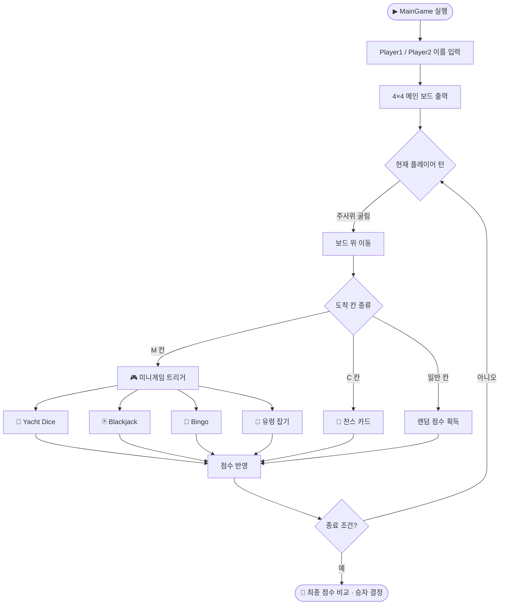

<div align="center">

# 🎲 javaAD

[English](README.md) | 한국어

**Java OOP 학습용 콘솔 게임 모음집**

4×4 보드맵 위에서 야추 다이스, 블랙잭, 빙고, 유령 잡기 미니게임을 즐기는 2인용 콘솔 게임 패키지

<br />

<p>
  
  
  
  
  
</p>

</div>

---

## 소개

`javaAD`는 **Java 객체지향 과제로 작성된 콘솔 기반 2인용 보드게임**입니다.
메인 보드 위에서 두 플레이어가 주사위를 굴려 이동하다가, 특정 칸에 도달하면 4가지 미니게임 중 하나가 실행되는 구조로 되어 있습니다.

> 모든 소스는 패키지 `AD_Project` 아래에 작성되어 있고, 외부 라이브러리 없이 **표준 JDK만으로 동작**합니다.

---

## 🕹️ 게임 라인업

메인 보드(`MainGame`)는 다음 4개의 미니게임을 호출합니다.

| # | 미니게임 | 진입 클래스 | 핵심 규칙 (요약) |
|---|---|---|---|
| 1 | 🎲 **Yacht Dice** | `YachtGame_Main` | 5개의 주사위로 족보(에이스~야추)를 채워 점수 합계 비교 |
| 2 | 🃏 **Blackjack** | `blackjack_withclass` | 카드 합 21에 가깝게 만들기 (Hit / Stay / Bust) |
| 3 | 🔢 **Bingo** | `BM` | 5×5 보드에서 숫자를 불러 라인을 먼저 완성 |
| 4 | 👻 **유령 잡기** | `oriented` | 6×6 보드 위에서 4 good / 4 bad 유령을 배치, 상대 진영의 화살표 칸으로 good을 보내거나 상대의 good을 모두 잡으면 승리 |

---

## 🗂️ 프로젝트 구조

```
javaAD/
├── MainGame.java              # 메인 진입점, 4×4 보드맵·턴 제어·미니게임 호출
├── YachtGame_Main.java        # 야추 다이스 본체 (mainGameConnect, p1player, p2player 포함)
├── ScoreBoard.java            # 야추 다이스 점수판 데이터 클래스
├── blackjack_withclass.java   # 블랙잭 (Game, Actor, ActorState enum)
├── BM.java                    # 5×5 빙고
├── oriented.java              # 유령 잡기 (Entity / GoodEntity / BadEntity / Ghost_move / GamePlay)
└── .gitignore                 # IntelliJ 및 Java 빌드 출력 무시 설정
```

### 파일별 역할

| 파일 | 주요 클래스 | 역할 |
|---|---|---|
| `MainGame.java` | `MainGame`, `MainGameBoard`, `GamePlayer` | **프로그램 진입점**. 두 플레이어의 이름을 입력받고 4×4 보드를 순회하며 턴 진행 |
| `YachtGame_Main.java` | `YachtGame_Main`, `mainGameConnect`, `p1player`, `p2player` | 야추 다이스 게임 루프, 주사위 굴리기/리롤, 점수 입력 |
| `ScoreBoard.java` | `ScoreBoard` | 야추 다이스 12개 족보별 점수/표시문자열/입력 가능 여부 상태 보관 |
| `blackjack_withclass.java` | `blackjack_withclass`, `Game`, `Actor`, `ActorState` | 카드 더미·플레이어/딜러 행동 상태(Hit·Stay·Bust)를 enum으로 모델링 |
| `BM.java` | `BM` | 무작위 셔플된 5×5 빙고판, 입력 숫자 매칭 후 라인 카운트 |
| `oriented.java` | `oriented`, `GamePlay`, `Ghost_move`, `Entity`, `GoodEntity`, `BadEntity` | 유령 4 good + 4 bad 배치, `wasd` 입력으로 이동, 화살표 칸 도달·전멸 조건 판정 |

---

## 🧩 OOP 학습 포인트

이 프로젝트는 **객체지향의 핵심 개념을 하나씩 직접 구현**하면서 익히는 데 초점이 있습니다.

<details>
<summary><b>어떤 OOP 개념이 어디서 등장하는지 펼쳐보기</b></summary>

| 개념 | 등장 위치 | 설명 |
|---|---|---|
| **클래스 / 인스턴스** | 전반 | `GamePlayer`, `Game`, `MainGameBoard` 등 게임 도메인을 클래스로 모델링 |
| **상속 (extends)** | `oriented.java` | `GoodEntity`, `BadEntity`가 공통 부모 `Entity`를 상속 |
| **상속 + 정적 필드 공유** | `YachtGame_Main.java` | `p1player`, `p2player`가 `mainGameConnect`를 상속해 이름/승패 상태 공유 |
| **다형성 / `instanceof`** | `oriented.java` (`Ghost_move.Check`) | 충돌한 유령이 `GoodEntity`인지 `BadEntity`인지 런타임 판별 |
| **enum** | `blackjack_withclass.java` | `ActorState { Hit, Stay, Bust }` 로 행동 상태를 표현 |
| **캡슐화 (getter/setter)** | `Actor`, `mainGameConnect` | private/protected 필드 + 접근자 메서드 |
| **정적 멤버 vs 인스턴스 멤버** | `MainGameBoard`, `mainGameConnect` | 게임 전역 상태(보드, 카운터, 플레이어 이름)는 static, 플레이어별 상태는 인스턴스 필드 |
| **객체 협력** | `MainGame` ↔ `MainGameBoard` ↔ `GamePlayer` | 보드가 플레이어 객체를 참조해 위치/상태를 갱신 |

</details>

---

## 🚀 빌드 & 실행

### 사전 준비

- **JDK 8 이상** 설치
- (권장) **IntelliJ IDEA** — 본 저장소에는 IntelliJ 프로젝트 메타데이터가 포함되어 있어 바로 열 수 있습니다.

### 방법 1: IntelliJ IDEA에서 실행 (권장)

1. IntelliJ IDEA에서 이 폴더를 **Open**
2. `MainGame.java`의 `main` 메서드 옆 ▶ 아이콘 클릭 → **Run 'MainGame.main()'**
3. 콘솔에 두 플레이어의 이름을 입력하면 게임 시작

### 방법 2: 명령줄에서 실행

모든 소스가 `package AD_Project;` 로 선언되어 있으므로, `AD_Project/` 하위로 옮긴 뒤 부모 디렉터리에서 컴파일해야 합니다.

```bash
# 1) 패키지 디렉터리 구조로 정리
mkdir -p AD_Project
cp *.java AD_Project/

# 2) 컴파일 (소스가 MS949 / CP949 인코딩이므로 -encoding 옵션 필수)
javac -encoding MS949 -d out AD_Project/*.java

# 3) 실행
java -cp out AD_Project.MainGame
```

> 💡 **Windows 콘솔(cmd)** 에서 한글이 깨진다면 `chcp 949` 후 실행하거나, 터미널 인코딩을 EUC-KR/MS949로 맞춰주세요.
> macOS / Linux의 UTF-8 터미널에서도 동작하지만, 소스 자체가 MS949이므로 컴파일 시 `-encoding MS949` 지정이 가장 안전합니다.

### 미니게임 단독 실행은 지원되지 않음

각 미니게임 클래스는 `static start(...)` / `static Bstart(...)` 형태의 호출 메서드를 제공하지만, 자체 `main` 메서드는 `MainGame` 한 곳뿐입니다. 실행은 `MainGame`을 통해서만 진행됩니다.

---

## 🔁 게임 흐름



---

## 📝 참고 사항

- 🇰🇷 **한글 인코딩**: 소스 파일은 `x-windows-949` (MS949 / CP949) 로 작성되어 있습니다. UTF-8 기준 도구로 열면 한글 주석이 깨져 보일 수 있습니다.
- 🧪 **별도의 테스트 코드는 포함되어 있지 않습니다.** 콘솔에서 직접 플레이하며 동작을 확인하는 형태입니다.
- 📦 **빌드 도구 없음**: Maven / Gradle 설정이 없으며, 표준 JDK의 `javac` / `java`만으로 충분합니다.
- 🎯 **목적**: 학습용 OOP 과제 — 실서비스/배포를 가정한 코드는 아닙니다.

---

<div align="center">

**[@mrpc2003](https://github.com/mrpc2003)**

이 저장소는 학습용 과제 모음입니다. 개선 아이디어나 버그 제보는 Issues / PR로 환영합니다.

</div>
