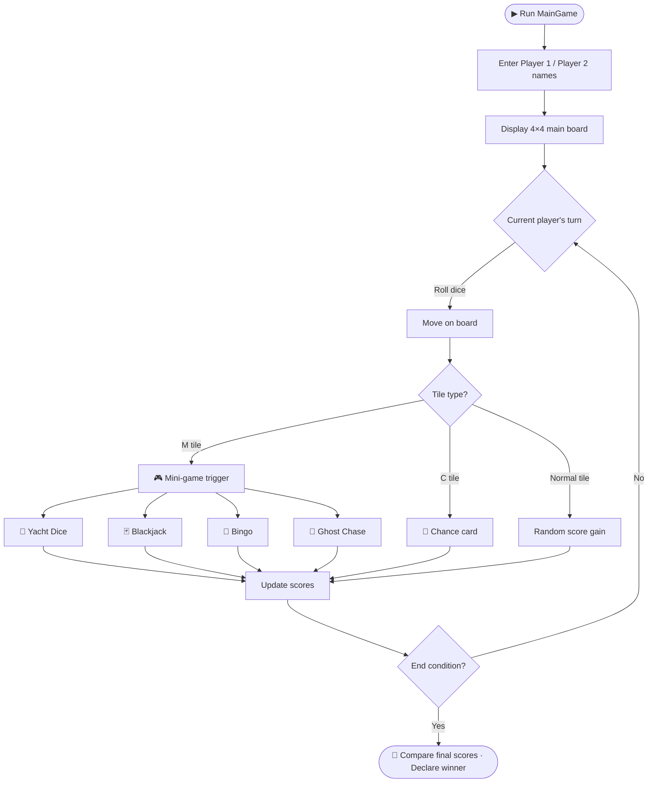

<div align="center">

# 🎲 Java Console Game Collection

English | [한국어](README.ko.md)

**Java OOP Coursework — Console Game Collection**

A 2-player console board game package featuring Yacht Dice, Blackjack, Bingo, and Ghost Chase mini-games on a 4×4 board map

<br />

<p>
  
  
  
  
  
</p>

</div>

---

## Overview

`java-console-game-collection` is a **console-based 2-player board game** written as a Java OOP coursework project.
Two players roll dice to move across a main board, and landing on specific tiles triggers one of four mini-games.

> All source files belong to the `AD_Project` package and run on the **standard JDK alone** — no external libraries required.

---

## 🕹️ Mini-Game Lineup

The main board (`MainGame`) dispatches to these four mini-games:

| # | Mini-Game | Entry Class | Core Rules |
|---|---|---|---|
| 1 | 🎲 **Yacht Dice** | `YachtGame_Main` | Roll 5 dice, fill scoring categories (Aces through Yacht), compare totals |
| 2 | 🃏 **Blackjack** | `blackjack_withclass` | Get as close to 21 as possible (Hit / Stay / Bust) |
| 3 | 🔢 **Bingo** | `BM` | Call numbers on a 5×5 board, first to complete a line wins |
| 4 | 👻 **Ghost Chase** | `oriented` | Place 4 good / 4 bad ghosts on a 6×6 board; send your good ghosts to the opponent's arrow tile or capture all their good ghosts to win |

---

## 🗂️ Project Structure

```
java-console-game-collection/
├── MainGame.java              # Entry point — 4×4 board, turn control, mini-game dispatch
├── YachtGame_Main.java        # Yacht Dice game loop (mainGameConnect, p1player, p2player)
├── ScoreBoard.java            # Yacht Dice scoreboard data class
├── blackjack_withclass.java   # Blackjack (Game, Actor, ActorState enum)
├── BM.java                    # 5×5 Bingo
├── oriented.java              # Ghost Chase (Entity / GoodEntity / BadEntity / Ghost_move / GamePlay)
└── .gitignore                 # IntelliJ & Java build output ignores
```

### File Responsibilities

| File | Key Classes | Role |
|---|---|---|
| `MainGame.java` | `MainGame`, `MainGameBoard`, `GamePlayer` | **Program entry point.** Accepts player names, renders the 4×4 board, manages turns |
| `YachtGame_Main.java` | `YachtGame_Main`, `mainGameConnect`, `p1player`, `p2player` | Yacht Dice game loop — rolling, re-rolling, score entry |
| `ScoreBoard.java` | `ScoreBoard` | Stores scores, display strings, and availability flags for 12 Yacht categories |
| `blackjack_withclass.java` | `blackjack_withclass`, `Game`, `Actor`, `ActorState` | Card deck, player/dealer state modeled with enum |
| `BM.java` | `BM` | Shuffled 5×5 bingo board, number matching, line counting |
| `oriented.java` | `oriented`, `GamePlay`, `Ghost_move`, `Entity`, `GoodEntity`, `BadEntity` | Ghost placement (4 good + 4 bad), `wasd` movement, win-condition checks |

---

## 🧩 OOP Concepts Demonstrated

This project focuses on **hands-on implementation of core OOP principles**.

<details>
<summary><b>Where each concept appears</b></summary>

| Concept | Location | Description |
|---|---|---|
| **Classes & Instances** | Throughout | `GamePlayer`, `Game`, `MainGameBoard` model the game domain |
| **Inheritance** | `oriented.java` | `GoodEntity` and `BadEntity` extend a common `Entity` parent |
| **Inheritance + Static Fields** | `YachtGame_Main.java` | `p1player` and `p2player` inherit from `mainGameConnect` to share name/win state |
| **Polymorphism / `instanceof`** | `oriented.java` (`Ghost_move.Check`) | Runtime check whether a captured ghost is `GoodEntity` or `BadEntity` |
| **Enum** | `blackjack_withclass.java` | `ActorState { Hit, Stay, Bust }` models player action state |
| **Encapsulation** | `Actor`, `mainGameConnect` | Private/protected fields with getter/setter methods |
| **Static vs Instance Members** | `MainGameBoard`, `mainGameConnect` | Global game state (board, counters) is static; per-player state is instance-level |
| **Object Collaboration** | `MainGame` ↔ `MainGameBoard` ↔ `GamePlayer` | Board references player objects to update position/state |

</details>

---

## 🚀 Build & Run

### Prerequisites

- **JDK 8+** installed
- (Recommended) **IntelliJ IDEA** — the repository includes IntelliJ project metadata for immediate use

### Option 1: IntelliJ IDEA (Recommended)

1. Open this folder in IntelliJ IDEA
2. Click the ▶ icon next to `main` in `MainGame.java` → **Run 'MainGame.main()'**
3. Enter two player names in the console to start

### Option 2: Command Line

All sources declare `package AD_Project;`, so they must be compiled from a parent directory:

```bash
# 1) Set up package directory structure
mkdir -p AD_Project
cp *.java AD_Project/

# 2) Compile (source files are MS949-encoded — the -encoding flag is required)
javac -encoding MS949 -d out AD_Project/*.java

# 3) Run
java -cp out AD_Project.MainGame
```

> 💡 On **Windows cmd**, run `chcp 949` first if Korean text appears garbled.
> On macOS/Linux UTF-8 terminals, the game may display Korean correctly, but always specify `-encoding MS949` at compile time.

### Note: No Standalone Mini-Game Execution

Each mini-game exposes a `static start(...)` / `static Bstart(...)` method but has no independent `main`. All games are launched through `MainGame`.

---

## 🔁 Game Flow



---

## 📝 Notes

- 🇰🇷 **Korean Encoding**: Source files are encoded in `x-windows-949` (MS949/CP949). Korean comments may appear garbled in UTF-8 editors.
- 🧪 **No automated tests** are included — gameplay is verified by playing directly in the console.
- 📦 **No build tools**: No Maven or Gradle configuration; standard `javac` / `java` is sufficient.
- 🎯 **Purpose**: Academic OOP coursework — not intended for production deployment.

---

<div align="center">

**[@mrpc2003](https://github.com/mrpc2003)**

This repository is a coursework game collection. Bug reports and improvement ideas are welcome via Issues or PRs.

</div>
